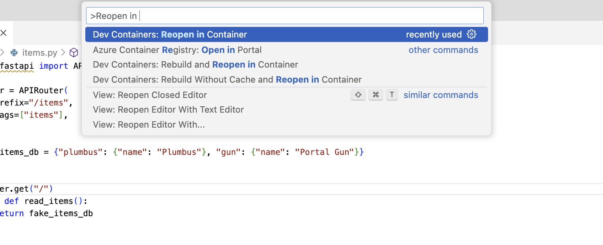

### Fastapi (a python freamwork) starter kit with vscode devcontainers support

**Requirments**:
- Install [Docker](https://www.docker.com/)
- Install [Visual Studio Code](https://code.visualstudio.com/)
- Install VS Code Extention [Dev Containers](https://marketplace.visualstudio.com/items?itemName=ms-vscode-remote.remote-containers)

**Run**:
Now open in **Dev Container**, See image below for instrction:

Thats it, now you can access server on  http://localhost:8000 and for api docs open http://localhost:8000/docs